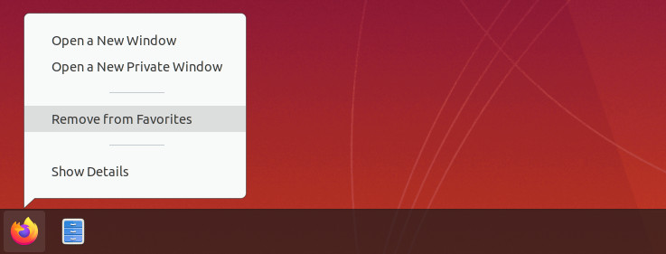

# Ubuntu setup and customization

I recently re-installed ubuntu on my laptop, to update to Eoan Ermine and also to get a "fresh" start. This is a task that I do quite infrequently. So normally when it becomes neccesary, I don't remember any more what kind of customizations I applied the last time. So directly after the install I do the few customizations I remember from the previous iteration. However the vast majority of configuration happens during the course of the following months: I notice something unpleasant and need to interrupt my current task, to search for a solution for the problem. Most of the time I notice that I already had the same problem the year before. And also the year before that year...

So this time I decided to be nice to future me and write down what I changed and customized after I finished the installation. This means many of these customizations are very opinionated and tailored to my needs, but maybe some steps are also relevant to others.
So without further ado, these are my steps to customize a fresh ubuntu installation:

## General

### Disable bell/beep in bash (e.x. auto complete fails/multiple options)

This is the feature that drives me nuts. So normally I notice it seconds after install.
- Bash completion ran into multiple options -> ring the bell. 
- You delete your input and there are no more characters to delete -> ring the bell. 

this bell can be muted by adding the following to `~.inputrc` (most probably does not exist yet):
```
# no beeps in terminal on auto complete fail
set bell-style visible
```

### Dock - remove all applications from favorites
I start applications by searching for them. So I don't need something I can click on with the mouse in my dock. Having only active applications in the dock, also helps me to see at a glance which applications are running.



- Right click the "favorite" application in the dock
- Click "Remove from Favorites"

### Dock references windows on all workspaces
The dock lists the applications of all workspaces by default. I use workspaces to separate different tasks I'm working on. Having the dock list all applications of all the different workspaces (tasks) is making it useless for me. I only want to have the applications/windows of the current workspace listed in the dock:

```
gsettings set org.gnome.shell.extensions.dash-to-dock isolate-workspaces true
```
[source](https://askubuntu.com/questions/992558/how-can-i-configure-the-ubuntu-dock-to-show-windows-only-from-the-current-worksp)

### Alt + Tab - cycle only the applications on the active workspace
Alt + Tab cycles through all applications by default, also the ones on other workspaces. As already mentioned, I like to organize my different tasks via workspaces, so I prefer to only cycle the windows on the current workspace with Alt + Tab:

```
gsettings set org.gnome.shell.app-switcher current-workspace-only true
```
[source](https://askubuntu.com/questions/464946/force-alt-tab-to-switch-only-on-current-workspace-in-gnome-shell)

### Alt + (key above tab - for me ^) - only cycle the windows on the active workspace
This might be another shortcut on non german keyboards. 
Same story for cycling through open windows of the same application. I prefer to only cycle through the running instances on the current workspace:
```
gsettings set org.gnome.shell.window-switcher current-workspace-only true
```

### Hide the "Apps" button in the dock
I don't use this button on the dock. So why not remove it.

Update: I had to enable the "Apps" button again. Removing it made switching workspaces very laggy. I think the "Apps" button is forcing the dock to be visible all the time. If it is not there, the dock hides and then immediately shows again if I'm switching workspaces. I think this is causing the stutter/lag. Maybe this is only happening to me as I removed all Favorite applications from the dock.
```
gsettings set org.gnome.shell.extensions.dash-to-dock show-show-apps-button false
```

### No mounted devices in dash
I find it very confusing to have mounted devices listed in the dock, but thats just my personal taste:
```
gsettings set org.gnome.shell.extensions.dash-to-dock show-mounts false
```

### Enable gnome shell extensions
setup to use the extensions on extensions.gnome.org

- sudo apt-get install chrome-gnome-shell
- open https://extensions.gnome.org/ in firefox
- install with "Click here to install browser extension"

### Install gTile

I use this to structure all the windows on a workspace, without the need to drag them around manually.

- you need to enable gnome shell extensions first (previous step)
- install gTile https://extensions.gnome.org/extension/28/gtile/
- How to use: https://github.com/gTile/gTile or just use super + alt -> num pad (1-9)

### Add mark/jump commands
I use this small "script" to "mark" important directories that I need to visit freuently. Such marked directories can then be opened easily with "jump":
```
$ cd very/long/path/to/some/important/dir
$ mark important
$ cd /
$ jump important
```
This even works with bash completion (you just type `jump i` and then press tab). However any praise should be redirected [here](https://news.ycombinator.com/item?id=6229001), were I got it from.
To enable this, you need to add the following script to your `.bashrc` (restart your terminal):
```
## BEGIN mark -> Jump dir (https://news.ycombinator.com/item?id=6229001) ##

export MARKPATH=$HOME/.marks
function jump { 
    cd -P $MARKPATH/$1 2>/dev/null || echo "No such mark: $1"
}
function mark { 
    mkdir -p $MARKPATH; ln -s $(pwd) "$MARKPATH/$1"
}
function unmark { 
    rm "$MARKPATH/$1"
}
function marks {
    ls -l $MARKPATH | sed 's// /g' | cut -d' ' -f9- | sed 's/ -/\t-/g' && echo
}

_completemarks() {
    local curw=${COMP_WORDS[COMP_CWORD]}
    local wordlist=$(find $MARKPATH -type l -printf "%f\n")
    COMPREPLY=($(compgen -W '${wordlist[@]}' -- "$curw"))
    return 0
}

complete -F _completemarks jump unmark

## END mark -> jump
```
The only thing missing with this script, is functionality that would make the marked directories also available via Nautilus in the "+Other Locations" section.

## Multi screen specific

The default settings for ubuntu in regards to multiple screens is not working for me. But at least this is easy to change to what I want:


### Second screen has fixed Workspace - Second screen not part of workspace
The second screen is fixed, and not part of the different workspaces. I like my workspaces to span all available screens:

```
gsettings set org.gnome.mutter workspaces-only-on-primary false
```
(source)[https://askubuntu.com/questions/1059479/dual-monitor-workspaces-in-ubuntu-18-04]

## Android Specific

I develop Android Apps...

### Android device udev configuration (fix device not visible)
Install the `android-sdk-platform-tools-common` to get the udev rules for android devices. This is needed so ubuntu detects the android devices properly (usb). Don't get fooled by the android documentation to install `adb`. This will result in two different version of adb being installed (one from the package and the other from AndroidStudio). These two version will kill each other all the time, as they have different versions. This is problematic as it will also kill your debug/profiler session or even worse, the whole setup to connect to a wearable device. This is the right package to install:
```
sudo apt-get install android-sdk-platform-tools-common
```

### export Android tools path
This makes the android tools, which are installed via Android Studio available from the terminal. The following `exports` need to be added to the `.bashrc` (restart your terminal):
```
## Android
export PATH=${PATH}:~/Android/Sdk/platform-tools
export PATH=${PATH}:~/Android/Sdk/tools
export ADB=~/Android/Sdk/platform-tools/adb
```
This will only start to work, once Android Studio was installed.

### install scrcpy
I installed the snap of [scrcpy](https://github.com/Genymobile/scrcpy). This application "copies" the screen of a connected android phone onto your computer screen 

## Misc
The small tweaks for applications that I use frequently, but disagree with their defaults.

### Disable Notifications for Spotify
If clicked, the notifications tend to open multiple spotify windows. And sometimes I even had infinite windows spawning. I could imagine that this is caused by the previously mentioned "isolate-workspaces" setting. I have no use for these notifications - most of the time I hear that a new song started, so I'm fine with just disabling them:

Spotify -> Settings -> Display Options -> "Show desktop notifications when the song changes"

### Disable Spotify announcements
Especially if they are animated, they tend to eat most of the cpu. Rigth now I only got a static image, but even disabling this one reduced the cpu usage of spotify by 50% (12% -> 6% cpu usage). As I never consume these announcments, I'm happy to disable them completely:

Spotify -> Settings -> Display Options -> "Show announcements about new releases"

### Firefox - "fix" ctrl-tab/ctrl-shift-tab behavior
In my book Ctrl + Tab/Ctrl-Shift-Tab should switch to the next(right)/previous(left) tab in the bar. Firefox by default switches to the tab, that was previously open. This behavior can be reverted by unchecking:
"Preferences" -> "Tabs" -> "Ctrl+Tab cycles through tabs in recently used order"


I'll update this list with additional customizations, as I remember and apply them. And by the way: You are welcome future me.
